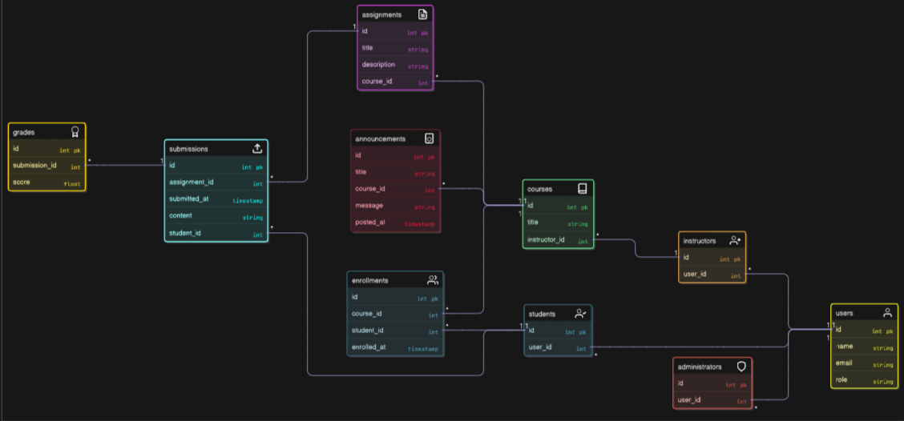

#  Online Course Management System 
This project represents a basic Online Course Management System implemented using fundamental Object-Oriented Programming (OOP) principles in JavaScript. It emulates real-world educational workflows involving students, instructors, courses, assignments, and grading.
## CLASS DIAGRAM

## OOP DESIGN:
#### Abstraction
Core operations like enroll, submitAssignment, and assignGrade are exposed clearly without showing internal mechanics.

#### Encapsulation
Private variables like _score, _email use getter/setter methods to control access.

#### Inheritance
Student, Instructor, and Administrator inherit from User, reducing redundancy.

#### Polymorphism
Role-specific methods like createCourse() and submitAssignment() are defined only in their respective subclasses.

## SOLID Principles Used:
S: Each class (e.g., Assignment, Grade) has one responsibility.

O: User is open for extension (subclasses) but closed for modification.

L: Student, Instructor, and Administrator can substitute User without issues.

I: Students/Instructors only access functions they need; no large interfaces.

D: Interactions like grading or announcements rely on abstracted objects (Grade, Announcement) passed into methods.

## CODE
```

class User {
  constructor(id, name, email) {
    this._id = id;
    this._name = name;
    this._email = email;
  }

  login() {
    console.log(`${this._name} logged in.`);
  }

  logout() {
    console.log(`${this._name} logged out.`);
  }

  viewCourses() {
    return "Generic course list";
  }


  get email() {
    return this._email;
  }

  set email(newEmail) {
    this._email = newEmail;
  }
}
class Student extends User {
  constructor(id, name, email) {
    super(id, name, email);
    this.enrolledCourses = [];
  }

  viewCourses() {
    return this.enrolledCourses;
  }

  enroll(course) {
    course.enrollStudent(this);
    this.enrolledCourses.push(course);
  }

  submitAssignment(assignment, content) {
    assignment.submit(this, content);
  }

 
}

class Instructor extends User {
  constructor(id, name, email) {
    super(id, name, email);
    this.coursesTaught = [];
  }

  viewCourses() {
    return this.coursesTaught;
  }

  createCourse(title) {
    const course = new Course(Date.now(), title, this);
    this.coursesTaught.push(course);
    return course;
  }

  gradeAssignment(assignment, student, score) {
    const grade = new Grade(student, assignment, score);
    assignment.setGrade(student, grade);
  }
}

class Course {
  constructor(id, title, instructor) {
    this.id = id;
    this.title = title;
    this.instructor = instructor;
    this.students = [];
    this.assignments = [];
  }

  enrollStudent(student) {
    this.students.push(student);
  }

  addAssignment(assignment) {
    this.assignments.push(assignment);
  }
}

class Assignment {
  constructor(id, title, description) {
    this.id = id;
    this.title = title;
    this.description = description;
    this.submissions = new Map();
    this.grades = new Map();
  }

  submit(student, content) {
    this.submissions.set(student._id, content);
  }

  getSubmission(student) {
    return this.submissions.get(student._id);
  }

  setGrade(student, grade) {
    this.grades.set(student._id, grade);
  }

  getGrade(student) {
    return this.grades.get(student._id);
  }
}

class Grade {
  constructor(student, assignment, score) {
    this.student = student;
    this.assignment = assignment;
    this._score = score;
  }

  getScore() {
    return this._score;
  }

  setScore(score) {
    this._score = score;
  }
}

```

## Class Roles
User: Base class for authentication and role handling

Student: Enrolls in courses, submits assignments, views grades

Instructor: Creates courses, posts announcements, grades submissions

Course: Manages assignments and student enrollments

Assignment: Holds assignment details and tracks submissions

Submission: Records student work for assignments

Grade: Associates scores with submissions

Announcement: Communicates updates to students in a course

